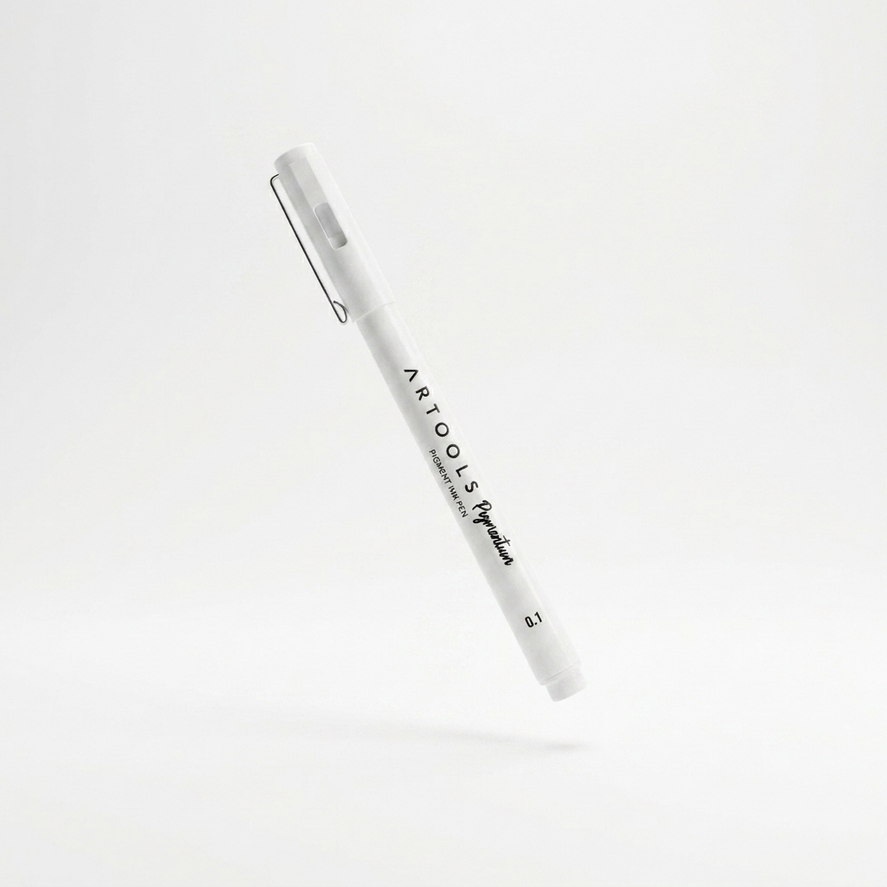

<div align="center"> 
<!-- Preview / Social Media Centralizada -->


<h1> Artools Precision Pen (Astro) </h1>

<!-- Badges (Gráficos referentes ao projeto) -->


</div>

## 📑 Descrição

Projeto **Artools Precision Pen**, laboratório de criação de software, sendo desenvolvido como estudo do curso de Webdesinger com IA do [Asimov Academy](https://www.asimov.academy/). Originalmente uma página estática em HTML, CSS e JS, foi totalmente modernizado para uma aplicação web performática e de alto padrão utilizando **Astro**.

## 🚀 Tecnologias

As principais ferramentas e tecnologias utilizadas na construção deste projeto foram:

- **[Astro](https://astro.build/)** - Framework web ideal para sites focados em conteúdo e landing pages, garantindo carregamento inicial instantâneo através da sua arquitetura de ilhas e HTML estático, ótimo para SEO.
- **[Tailwind CSS](https://tailwindcss.com/)** - Framework CSS utilitário para estilização rápida, responsiva e consistente direto na marcação.
- **[GSAP & ScrollTrigger](https://gsap.com/)** - Bibliotecas de animação utilizadas para criar efeitos visuais imersivos e fluidos ao rolar a página.

---

## 🛠️ Como executar o projeto

```bash
# Clone este repositório
git clone https://github.com/Paulohbarbosa/artools-Caneta-Astro

# Acesse a pasta do projeto no terminal/cmd
cd Site_Astro-Lab

# Instale as dependências
npm install

# Execute a aplicação em modo de desenvolvimento
npm run dev
```
